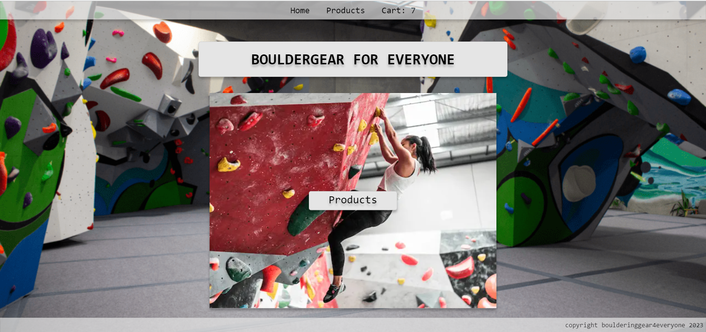
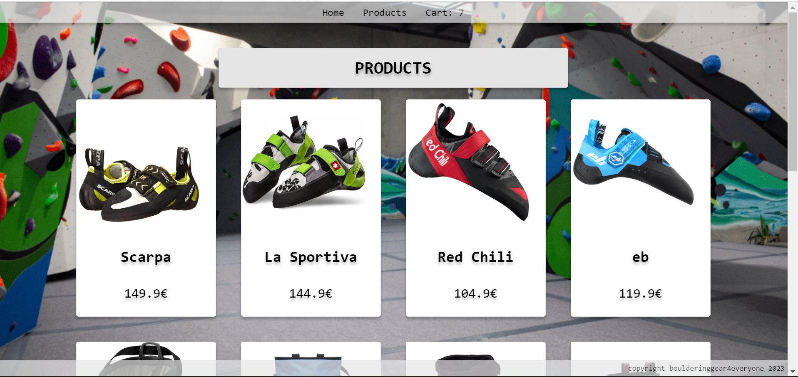
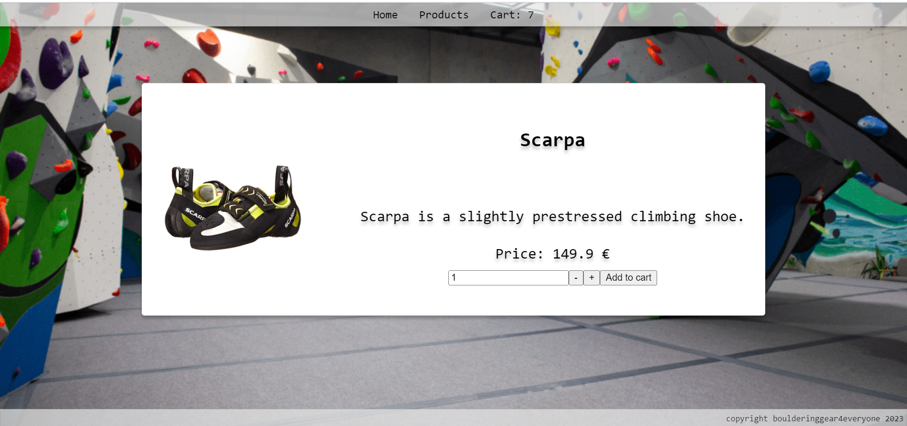

# E-commerce store: Bouldergear for everyone

## Descripton

This is an ecommerce store built as a practice project during the upLeveled web development bootcamp. This site is simulating a real ecommerce shopping experience without the payment process.

## Technologies used

- Next.js
- PostgreSQL
- Playwright

Languages:

- JavaScript
- JSX
- TypeScript
- TSX

## Screenshots

### Homepage



### Products Overview



### Product View



## Setup instructions

1. Clone the project on your local machine (run each line individually):

```bash
git clone <url>
cd <repo name>
yarn
```

2. Connect to default database as admin:

- On Windows

```bash
psql -U postgres
```

-On macOS

```bash
psql postgres
```

-On Linux

```bash
sudo -u postgres psql
```

3. Set up the database:

```bash
CREATE DATABASE <database name>;
CREATE USER <user name> WITH ENCRYPTED PASSWORD <user password>;
GRANT ALL PRIVILEGES ON DATABASE <database name> TO <user name>;
```

4. After queries are successfully ran, quit `psql` and connect to the database

```bash
\q
```

- On Windows & macOS

```bash
psql -U <user name> <database name>
```

- On Linux

```bash
sudo -u <user name> psql -U <user name> <database name>
```

5. In the repository's directory, run migrations using ley:

```bash
yarn migrate up
```

6. Create a .env file:

- Open the project in your code editor
- Copy the content of the .env.example file into the .env file
- Replace xxxxxxxx with the access information
- add .env file to .gitignore

7. (Optional) Start deployment server:

```bash
yarn dev
```

Open [http://localhost:3000](http://localhost:3000) in your browser to see the result.

# Deployment instructions
